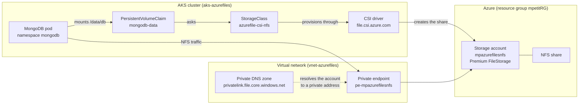

#  MongoDB on AKS with Azure Files NFS 

Persist the data of a **MongoDB** database running on a managed **AKS** cluster,
on an **Azure Files** share mounted over **NFS**, provisioned dynamically by the
native CSI driver `file.csi.azure.com`.

The whole Azure side is described with **Terraform**: network, Premium storage
account, private endpoint and private DNS. The share never leaves the virtual
network, and the MongoDB credentials never enter the repository.

Full brief: [`docs/CONSIGNES.md`](docs/CONSIGNES.md).

## Architecture



## Requirements

- An Azure subscription, with `az` logged in
- [Terraform](https://developer.hashicorp.com/terraform/downloads) >= 1.9
- [kubectl](https://kubernetes.io/docs/tasks/tools/)
- [glab](https://gitlab.com/gitlab-org/cli), for the GitLab remote state
- A GitLab personal access token with the `api` scope

## Design decisions

### Azure Files over NFS rather than SMB or a managed disk

Azure Files answers on two protocols. SMB works everywhere but authenticates
with an account key that has to be stored as a Kubernetes Secret, and its
POSIX semantics are approximate for a database. NFS carries no key at all:
access is granted by the network, which is why the private endpoint matters so
much here.

An Azure Disk was the other candidate, and it would be faster. It was rejected
because a disk attaches to one node at a time, so the volume follows the node
rather than the workload, and `ReadWriteMany` is impossible.

The price of NFS is a hard constraint: it exists only on **Premium
FileStorage** accounts, where the smallest billed share is 100 GiB.

### The storage account is closed to the Internet

`public_network_access_enabled` is false, and the cluster reaches the account
through a private endpoint placed on the node subnet. The alternative, leaving
the account reachable and filtering by IP, would have been simpler to set up
and would have exposed a database share to the Internet.

This forces a second setting that reads like a mistake and is not one:

```hcl
https_traffic_only_enabled = false
```

NFS v3 has no transport encryption, so Azure refuses to serve NFS on an account
that requires HTTPS. Confidentiality comes from the traffic never leaving the
virtual network.

### Terraform creates the account, the driver only creates shares

The StorageClass names an existing account:

```yaml
parameters:
  protocol: nfs
  resourceGroup: mpetitRG
  storageAccount: mpazurefilesnfs
```

Without those two parameters the driver provisions an account of its own, in
the `MC_` resource group managed by AKS, with no private endpoint. That account
would disappear with the cluster, and the networking work would be pointless.

The counterpart is a permission: the node pool identity holds **Storage Account
Contributor** on the account, the narrowest built in role that lets the driver
create and resize shares. `Contributor` on the resource group would also work
and would grant far more.

### The virtual network lives in the project resource group

Letting AKS generate its own network is one line shorter, but the network then
lives in the `MC_` resource group, deleted with the cluster. Since the storage
account and the private endpoint must sit in that same network, the cluster
could not be destroyed at the end of a session without taking the storage with
it. Declaring the network in `mpetitRG` makes `make destroy` and `make up`
a daily routine instead of a rebuild.

### MongoDB credentials come from a gitignored file

The provided manifests carried the root password as a literal in
`kustomization.yaml`, in clear text in a public repository. The generator now
reads `kubernetes/mongodb.env`, which is gitignored and produced by
`make setup` with a random password.

Kustomize appends a hash of the content to the Secret name and rewrites every
reference to it, so changing the password changes the Deployment and triggers a
rollout. A Secret with a fixed name would leave the pods running with the old
value.

Note that `MONGO_INITDB_ROOT_*` is read only when the data directory is empty.
Once the database is initialized on the persistent volume, rotating the
password is a MongoDB operation, not a Kubernetes one.

## Setup

```bash
make setup    # once per clone: .env and the MongoDB password
make up       # terraform, kubeconfig, StorageClass, MongoDB
make verify   # CSI driver, dynamic provisioning, NFS mount
make persistence
make destroy
```

`make up` plans and applies in one go, without pausing for review, which suits
a lab rebuilt every day. To read the plan before it runs, use the scripts
directly: `./scripts/infra.sh plan`, then `./scripts/infra.sh apply`.

The StorageClass is created inside `make up`, before the claim. It is not part
of `kubernetes/kustomization.yaml`: the kustomization forces `namespace:
mongodb`, and a StorageClass is cluster scoped. Applying the manifests without
it leaves the PVC `Pending` on a class that does not exist, and the rollout
times out.

`make help` lists every target. The single steps each one chains stay
available through the scripts in `scripts/`.

## Documentation

**Azure Files and NFS**

- [NFS file shares in Azure Files](https://learn.microsoft.com/azure/storage/files/files-nfs-protocol)
- [Create an NFS share](https://learn.microsoft.com/azure/storage/files/storage-files-how-to-create-nfs-shares)
- [Private endpoints for Azure Files](https://learn.microsoft.com/azure/storage/files/storage-files-networking-endpoints)

**Kubernetes storage**

- [Persistent Volumes](https://kubernetes.io/docs/concepts/storage/persistent-volumes/)
- [Storage Classes](https://kubernetes.io/docs/concepts/storage/storage-classes/)
- [Azure Files CSI driver on AKS](https://learn.microsoft.com/azure/aks/azure-csi-files-storage-provision)

**Terraform**

- [azurerm provider](https://registry.terraform.io/providers/hashicorp/azurerm/latest/docs)
- [GitLab managed Terraform state](https://docs.gitlab.com/user/infrastructure/iac/terraform_state/)
